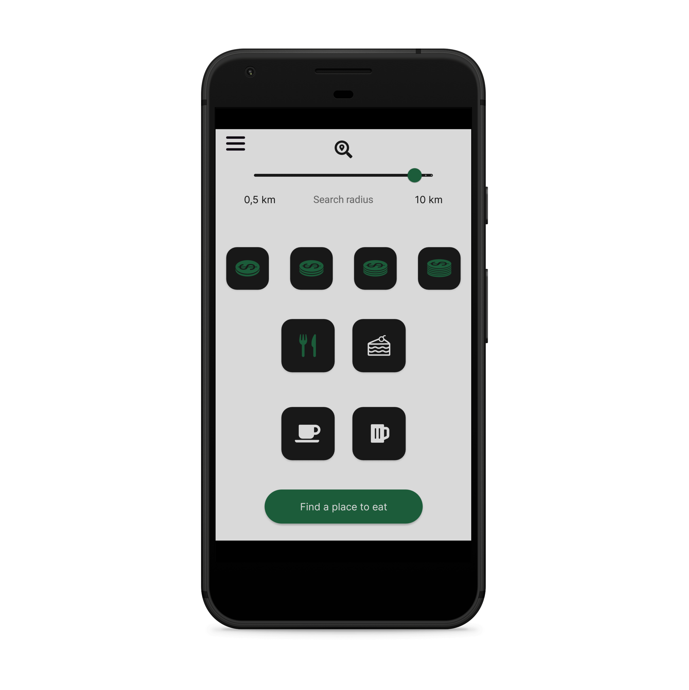
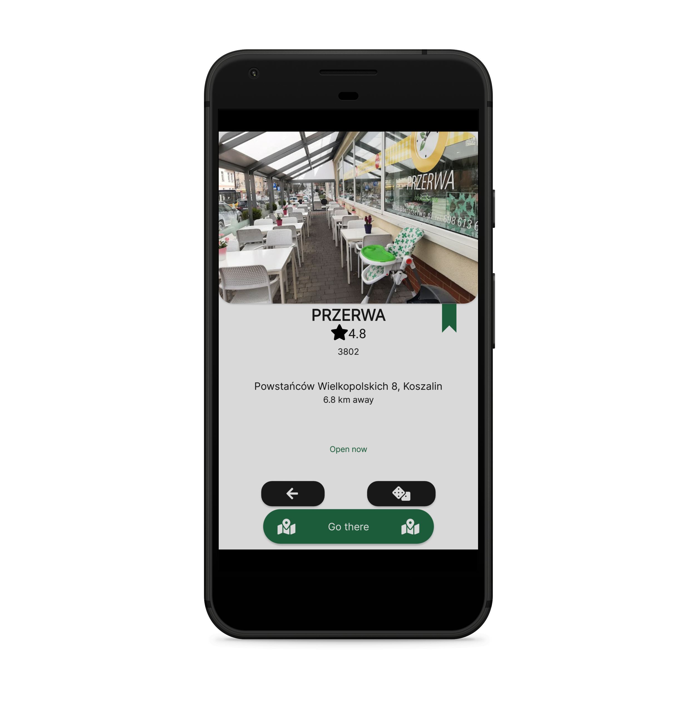

# Candy recognizer 
## Overview
> The end-of-semester project for Mobile Applications

This android app uses [Where-to-eat API](https://github.com/xalpol12/where-to-eat-backend) backend service to send and receive calls from

Minimum supported Android version is: **Android 6.0**

  

## General Information
The application allows you to search for places nearby using the location provided by phone's GPS sensor. Request is sent to a remote server, which responds with a list of found, suitable places. The app then displays available results. 

User has the option to:
* save currently displayed place in a local database, 
* turn on Google Maps navigation to a selected place,
* select next place from the list.

All the details about the remote server endpoints can be found in [Where-to-eat API](https://github.com/xalpol12/where-to-eat-backend) documentation.

Project is compliant with **MVVC** architecture and uses dependency injection provided by **Hilt**.

App supports polish, english and french language.

## Technologies Used
- Java 9 with Android Studio
- Retrofit 2.9.0
- Room 2.5.1
- Dagger-Hilt 2.45
- AndroidX Lifecycle

## Features

### Fragment: Find place
**Sends a request with selected parameters**

### Fragment: Place
**Receives and displays a response from server**

Click ribbon on the right to save currently displayed place to database

### Fragment: Saved places
**Receives and displays a response from server**

Swipe left to delete an entry, tap to display details

### Sidebar
**Provides smooth navigation between fragments**

## Setup
To install this application on Android phone:
* Download an _.apk_ file available in **Releases** tab (current active release is _v1.0.0_)

or
* Clone this repository and open it in Android Studio

## Project Status
Project is: _complete_ 

## Room for Improvement
Room for improvement:
- Account creation and user authentication
- Ability to share a link and add a new place using generated link
- Ability to create a note and rate selected place